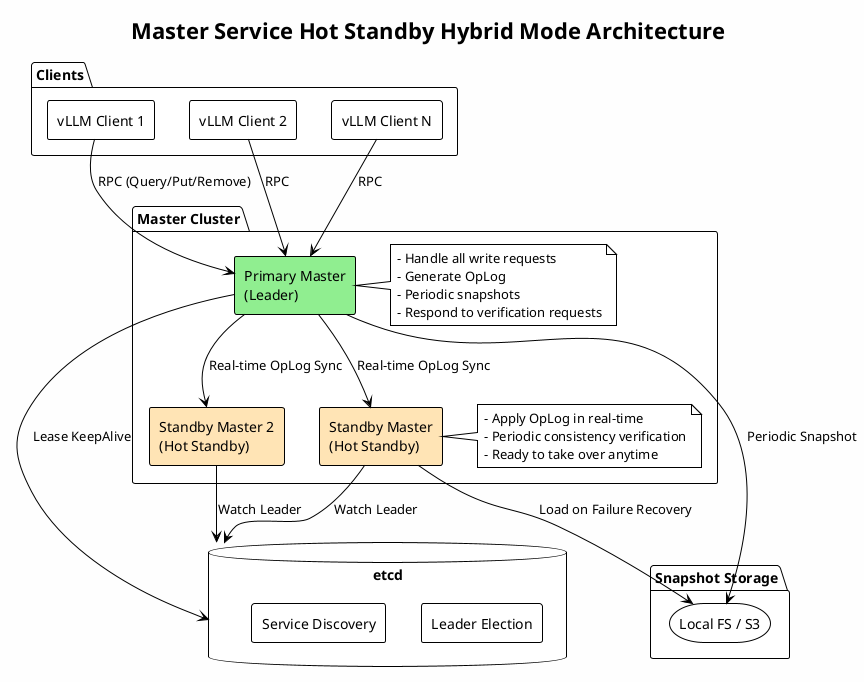
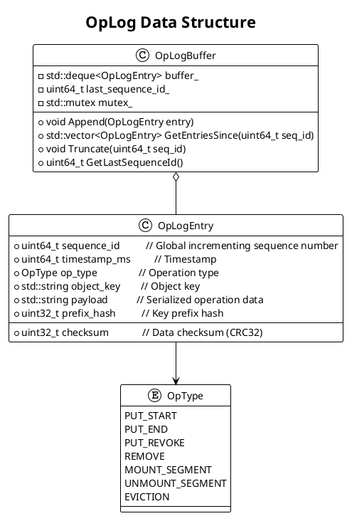
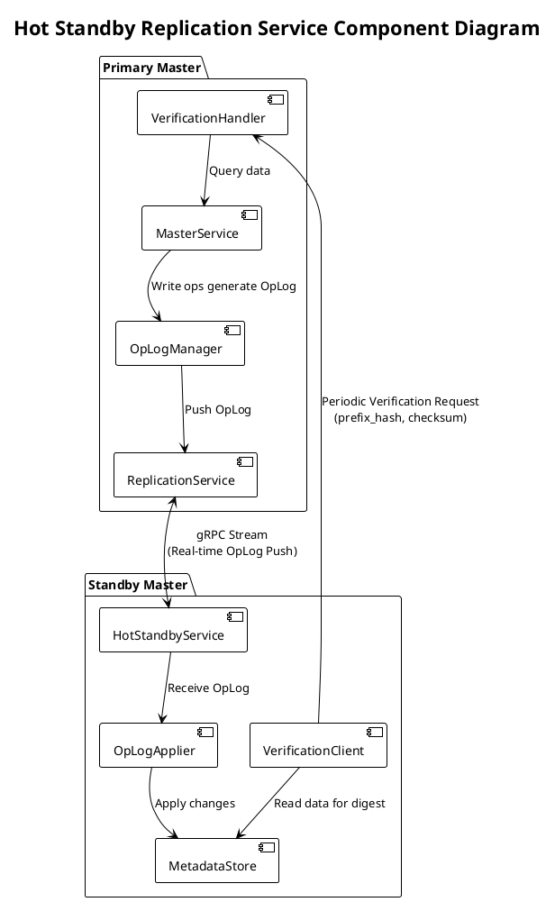
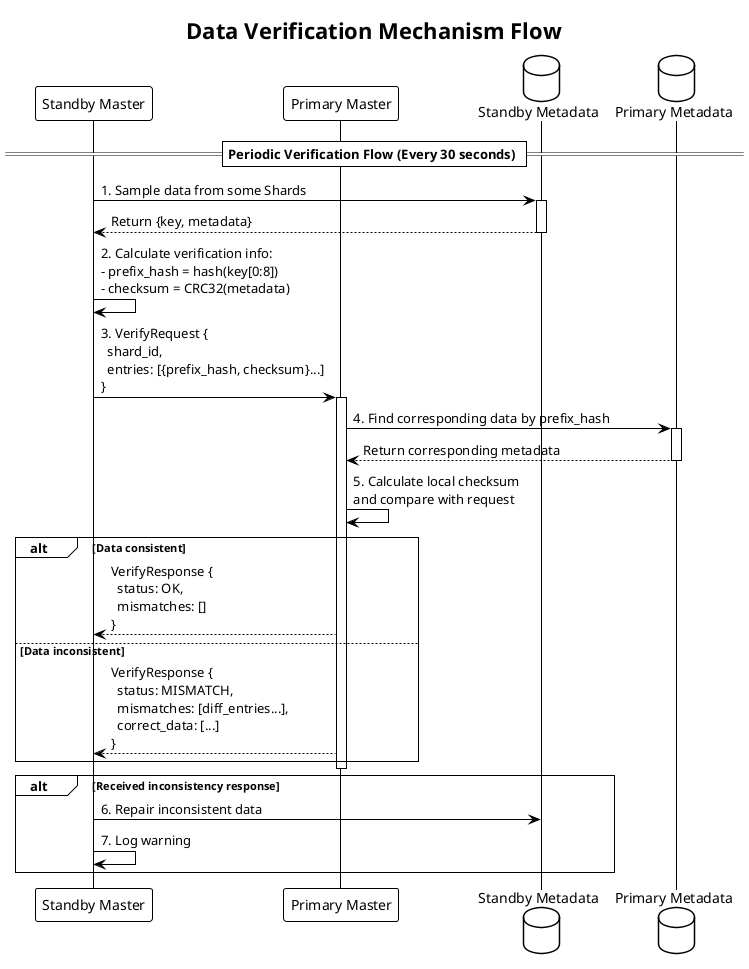
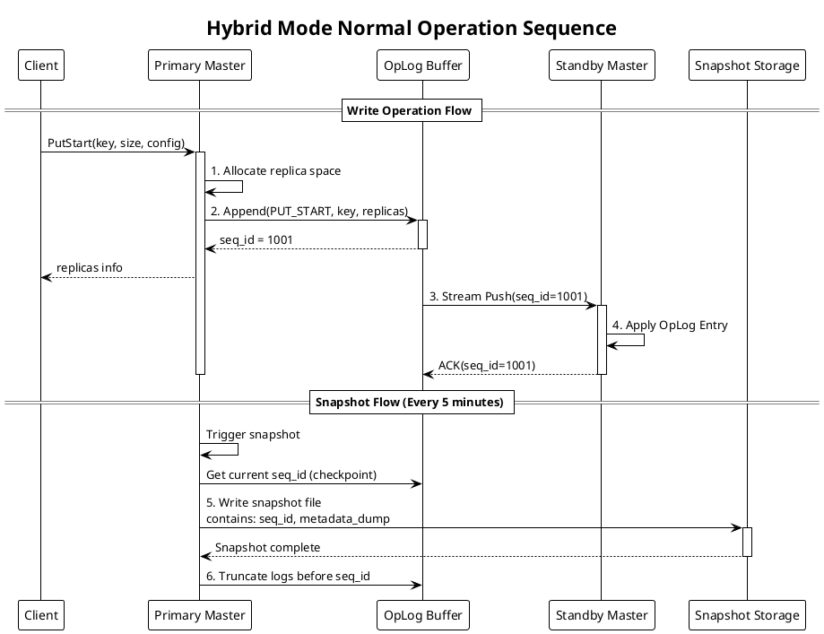
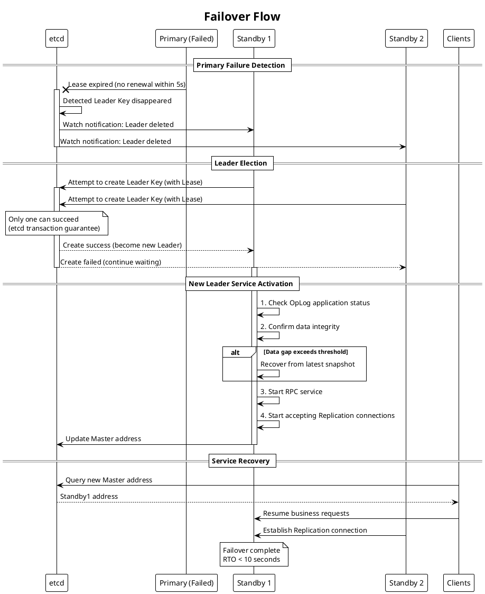
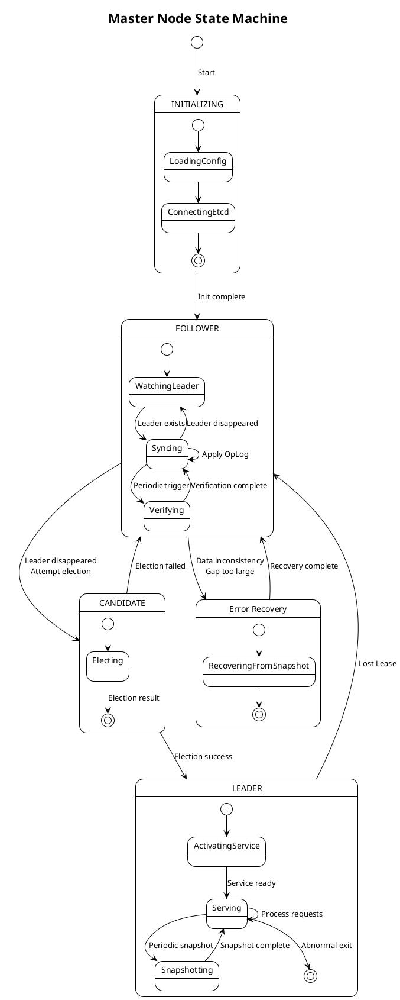
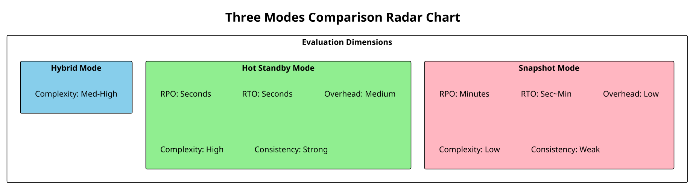
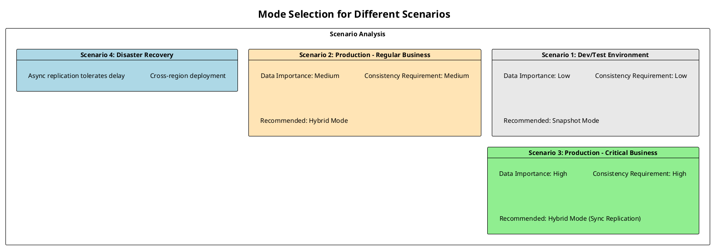

# RFC: Master Service Metadata High Availability - Hot Standby & Hybrid Mode Design

## Document Information

| Item | Content |
|------|---------|
| Author | Mooncake Team |
| Status | Draft |
| Created | 2024-12 |
| Version | v1.0 |

---

## 1. Background

### 1.1 Mooncake Storage Architecture Overview

Mooncake Store adopts a metadata-data separation architecture:

- **Master Service**: Centralized metadata service responsible for managing object replica locations, space allocation, lease management, etc.
- **Client Nodes**: Distributed storage nodes that actually store KV Cache data, using Transfer Engine for data transfer
- **etcd**: Used for leader election and service discovery

```
┌─────────────────────────────────────────────────────────────────────────┐
│                     Mooncake Store Architecture Overview                 │
├─────────────────────────────────────────────────────────────────────────┤
│                                                                         │
│     ┌──────────────┐                                                    │
│     │    vLLM      │                                                    │
│     │  Inference   │                                                    │
│     └──────┬───────┘                                                    │
│            │                                                            │
│   ┌────────▼────────┐    Query Metadata    ┌───────────────────┐       │
│   │  Mooncake Client ├────────────────────►│  Master Service    │       │
│   │                 │◄────────────────────┤  (Single/HA Mode)   │       │
│   └────────┬────────┘    Replica Info      └─────────┬─────────┘       │
│            │                                         │                  │
│            │ Data Transfer (RDMA/TCP)               │ Leader Election  │
│            ▼                                         ▼                  │
│   ┌─────────────────────────────────┐           ┌──────────────────┐   │
│   │      Storage Clients            │           │       etcd        │   │
│   │  [Node1] [Node2] [Node3]        │           │ (Service Discovery)│   │
│   └─────────────────────────────────┘           └──────────────────┘   │
│                                                                         │
└─────────────────────────────────────────────────────────────────────────┘
```

### 1.2 Current HA Implementation

Mooncake has implemented etcd-based leader election:

- Multiple Master instances compete to become Leader after startup
- Only the Leader provides RPC services
- Follower nodes wait in `WatchUntilDeleted` state
- When Leader fails, Followers re-elect

### 1.3 Metadata Structure

Core metadata structure (`ObjectMetadata`) managed by Master Service:

```cpp
struct ObjectMetadata {
    std::vector<Replica> replicas;           // Replica list (contains storage locations)
    size_t size = 0;                         // Object size
    std::chrono::steady_clock::time_point 
        lease_timeout;                       // Lease expiration time
    std::chrono::steady_clock::time_point 
        soft_pin_timeout;                    // Soft pin expiration time
};
```

Metadata is sharded across 1024 shards by key:

```cpp
static constexpr size_t kNumShards = 1024;
std::array<MetadataShard, kNumShards> metadata_shards_;
```

---

## 2. Problem Statement

### 2.1 Metadata Loss Risk

| Problem | Impact | Severity |
|---------|--------|----------|
| **All metadata lost after Leader failure** | All KV Cache location info lost, needs rebuild | 🔴 Critical |
| **No data pre-warming on Follower** | Must start from scratch after election | 🟠 Medium |
| **Long recovery time** | Depends on client re-registration, may take minutes to tens of minutes | 🟠 Medium |
| **Service unavailability window** | Cannot process requests during Leader switch | 🟡 Minor |

### 2.2 Limitations of Snapshot Mode

Assuming snapshot mode is implemented, it has the following issues:

```
                    Snapshot Mode Timeline
    ─────────────────────────────────────────────────────►
    │         │         │         │         │
    T1        T2        T3        T4        T5
    ▼         ▼         ▼         ▼         ▼
  [Snap1]   [Write]   [Write]   [Fail]    [Recover]
    │                    │         │         │
    └────────────────────┘         │         │
        This data is lost ◄────────┘         │
                                             │
                      Recover from Snap1, lose T2-T4 data
```

| Problem | Description |
|---------|-------------|
| **Non-zero RPO** | Data between snapshots may be lost |
| **Snapshot interval dilemma** | Short interval → high overhead; Long interval → more data loss |
| **Recovery requires loading** | Large metadata sets take time to load |
| **Cannot handle sudden failures** | Worst case when failure occurs during snapshot |

### 2.3 Requirements Analysis

Based on the above pain points, we need:

1. **Near-zero RPO**: Minimize data loss window
2. **Fast failover**: Second-level RTO (Recovery Time Objective)
3. **Data consistency guarantee**: Correct primary-backup data synchronization
4. **Verifiability**: Mechanism to verify data integrity
5. **Low performance overhead**: No impact on normal business

---

## 3. Design

### 3.1 Overall Architecture

We propose **Hot Standby Mode** combined with **Periodic Snapshots** as a **Hybrid Mode**:



### 3.2 Core Component Design

#### 3.2.1 OpLog (Operation Log) Design

OpLog is the core of hot standby implementation, recording all state-changing operations:



**OpLog Entry Field Description**:

| Field | Type | Description |
|-------|------|-------------|
| `sequence_id` | uint64_t | Global incrementing sequence number, ensures ordering |
| `timestamp_ms` | uint64_t | Operation timestamp |
| `op_type` | enum | Operation type (PUT_START/PUT_END/REMOVE, etc.) |
| `object_key` | string | Object key being operated on |
| `payload` | bytes | Serialized operation-related data |
| `checksum` | uint32_t | CRC32 checksum of payload |
| `prefix_hash` | uint32_t | Hash of object_key prefix (for verification) |

#### 3.2.2 Hot Standby Replication Service



#### 3.2.3 Verification Mechanism Design

The verification mechanism is key to ensuring primary-backup data consistency:



**Verification Request Data Structure**:

```cpp
struct VerificationEntry {
    uint32_t prefix_hash;    // Key prefix hash (hash of first 8 bytes)
    uint32_t checksum;       // CRC32 checksum of this metadata entry
};

struct VerificationRequest {
    uint32_t shard_id;                      // Shard ID being verified
    uint64_t standby_last_seq_id;           // Max seq_id applied by Standby
    std::vector<VerificationEntry> entries; // Verification entries list
};

struct VerificationResponse {
    enum Status { OK, MISMATCH, NEED_FULL_SYNC };
    Status status;
    std::vector<MismatchEntry> mismatches;  // Inconsistent entries
    std::vector<CorrectData> corrections;   // Correct data (for repair)
};
```

**Verification Strategy**:

| Parameter | Default | Description |
|-----------|---------|-------------|
| Verification Interval | 30 sec | Time interval between verification rounds |
| Sample Ratio | 10% | Percentage of shards verified per round |
| Entries per Shard | 100 | Max keys sampled per shard |
| Full Verification Cycle | 5 min | Time to complete one full round of all shards |

### 3.3 Hybrid Mode Workflow

#### 3.3.1 Normal Operation Sequence



#### 3.3.2 Failover Flow



### 3.4 Data Structures and Interface Design

#### 3.4.1 Core Data Structures

```cpp
// OpLog Entry
struct OpLogEntry {
    uint64_t sequence_id;
    uint64_t timestamp_ms;
    OpType op_type;
    std::string object_key;
    std::string payload;        // Serialized operation data
    uint32_t checksum;          // CRC32(payload)
    uint32_t prefix_hash;       // hash(object_key.substr(0, 8))
    
    // Serialization support
    YLT_REFL(OpLogEntry, sequence_id, timestamp_ms, op_type, 
             object_key, payload, checksum, prefix_hash);
};

// OpLog Manager
class OpLogManager {
public:
    // Append log entry
    uint64_t Append(OpType type, const std::string& key, 
                    const std::string& payload);
    
    // Get all entries after specified sequence number
    std::vector<OpLogEntry> GetEntriesSince(uint64_t seq_id);
    
    // Get latest sequence number
    uint64_t GetLastSequenceId() const;
    
    // Truncate old logs (called after snapshot)
    void TruncateBefore(uint64_t seq_id);

private:
    std::deque<OpLogEntry> buffer_;
    uint64_t last_sequence_id_ = 0;
    mutable std::shared_mutex mutex_;
    
    // Limit memory usage
    static constexpr size_t kMaxBufferSize = 100000;
};

// Hot Standby Service (runs on Standby nodes)
class HotStandbyService {
public:
    // Connect to Primary and start synchronization
    ErrorCode ConnectToPrimary(const std::string& primary_addr);
    
    // Handle received OpLog
    void OnOpLogReceived(const std::vector<OpLogEntry>& entries);
    
    // Get current sync progress
    uint64_t GetAppliedSequenceId() const;
    
    // Trigger data verification
    ErrorCode TriggerVerification();

private:
    std::unique_ptr<MetadataStore> metadata_store_;
    std::unique_ptr<OpLogApplier> applier_;
    std::unique_ptr<VerificationClient> verify_client_;
    std::atomic<uint64_t> applied_seq_id_ = 0;
};

// Replication Service (runs on Primary node)
class ReplicationService {
public:
    // Register Standby connection
    void RegisterStandby(const std::string& standby_id, 
                        ReplicationStream* stream);
    
    // Broadcast OpLog to all Standbys
    void BroadcastOpLog(const OpLogEntry& entry);
    
    // Handle verification request
    VerificationResponse HandleVerification(
        const VerificationRequest& request);

private:
    std::unordered_map<std::string, ReplicationStream*> standbys_;
    std::shared_mutex mutex_;
};
```

#### 3.4.2 RPC Interface Definition

```protobuf
// Replication Service RPC Interface
service ReplicationService {
    // OpLog streaming sync
    rpc SyncOpLog(SyncOpLogRequest) returns (stream OpLogEntry);
    
    // Data verification
    rpc Verify(VerificationRequest) returns (VerificationResponse);
    
    // Request full snapshot
    rpc RequestSnapshot(SnapshotRequest) returns (SnapshotResponse);
}

message SyncOpLogRequest {
    uint64 start_seq_id = 1;    // Start syncing from this sequence number
    string standby_id = 2;       // Standby identifier
}

message VerificationRequest {
    uint32 shard_id = 1;
    uint64 standby_last_seq_id = 2;
    repeated VerificationEntry entries = 3;
}

message VerificationEntry {
    uint32 prefix_hash = 1;     // Key prefix hash
    uint32 checksum = 2;        // Metadata checksum
}

message VerificationResponse {
    enum Status {
        OK = 0;
        MISMATCH = 1;
        NEED_FULL_SYNC = 2;
    }
    Status status = 1;
    repeated MismatchEntry mismatches = 2;
}

message MismatchEntry {
    uint32 prefix_hash = 1;
    string object_key = 2;
    bytes correct_metadata = 3;  // Correct metadata
}
```

### 3.5 State Machine Design



### 3.6 Configuration Parameters

```cpp
struct HotStandbyConfig {
    // OpLog configuration
    size_t oplog_buffer_size = 100000;       // OpLog buffer size
    uint64_t oplog_retention_ms = 300000;    // OpLog retention time (5 min)
    
    // Replication configuration
    uint32_t replication_batch_size = 100;   // Batch sync count
    uint32_t replication_timeout_ms = 1000;  // Sync timeout
    bool sync_replication = false;           // Whether to use sync replication
    
    // Verification configuration
    uint32_t verify_interval_sec = 30;       // Verification interval
    float verify_sample_ratio = 0.1;         // Sample ratio (10%)
    uint32_t verify_entries_per_shard = 100; // Entries per shard to sample
    
    // Snapshot configuration
    uint32_t snapshot_interval_sec = 300;    // Snapshot interval (5 min)
    std::string snapshot_path = "/var/mooncake/snapshots";
    
    // Failover configuration
    uint64_t max_lag_for_promotion_ms = 5000; // Max lag allowed for promotion
};
```

---

## 4. Comparison Analysis

### 4.1 Three Modes Comparison



### 4.2 Detailed Comparison Table

| Dimension | Snapshot Mode | Hot Standby Mode | Hybrid Mode |
|-----------|---------------|------------------|-------------|
| **RPO (Data Loss)** | Minutes (snapshot interval) | Seconds (async) / 0 (sync) | Seconds |
| **RTO (Recovery Time)** | 10s~min (depends on data size) | < 5s (hot switch) | < 5s |
| **Performance Overhead** | Low (only during snapshot) | Medium (continuous sync) | Medium |
| **Storage Overhead** | High (full snapshot) | Low (OpLog only) | Medium (snapshot+OpLog) |
| **Implementation Complexity** | Low | High | Medium-High |
| **Network Bandwidth** | Low (periodic) | Medium (continuous) | Medium |
| **Consistency Guarantee** | Eventual | Strong (configurable) | Strong |
| **Verifiability** | Weak | Strong (verification mechanism) | Strong |
| **Cold Start Recovery** | ✅ Supported | ❌ Depends on Primary | ✅ Supported |
| **Use Cases** | Low-frequency updates, large data | High-frequency updates, strong consistency | General scenarios |

### 4.3 Pros and Cons Analysis

#### Snapshot Mode

**Pros**:
- ✅ Simple implementation, mature and reliable
- ✅ Predictable performance overhead
- ✅ Supports independent cold start recovery
- ✅ Minimal impact on Primary node

**Cons**:
- ❌ Large RPO, may lose significant data
- ❌ Slow recovery with large data
- ❌ Cannot verify data consistency
- ❌ Performance jitter during snapshot

#### Hot Standby Mode

**Pros**:
- ✅ Extremely low RPO, near-zero data loss
- ✅ Extremely low RTO, second-level switching
- ✅ Verification mechanism, can verify consistency
- ✅ Standby ready to take over anytime

**Cons**:
- ❌ High implementation complexity
- ❌ Requires continuous network bandwidth
- ❌ Cannot cold start when used alone
- ❌ Complex OpLog management

#### Hybrid Mode (Recommended)

**Pros**:
- ✅ Combines hot standby's low RPO/RTO
- ✅ Supports cold start recovery (from snapshot)
- ✅ Verification mechanism ensures consistency
- ✅ Strong fault tolerance

**Cons**:
- ❌ Higher implementation complexity
- ❌ Increased operational complexity
- ❌ Requires additional storage space

### 4.4 Scenario Applicability Analysis



---

## 5. Implementation Plan

### 5.1 Phase Division

```plantuml
@startuml
!theme plain
title Implementation Phase Gantt Chart

project starts 2024-12-15

[Phase 1: OpLog Infrastructure] starts 2024-12-15 and lasts 14 days
[OpLog Data Structure Implementation] starts 2024-12-15 and lasts 7 days
[OpLog Serialization/Deserialization] starts 2024-12-22 and lasts 7 days

[Phase 2: Replication Service] starts 2024-12-29 and lasts 21 days
[Replication RPC Interface] starts 2024-12-29 and lasts 7 days
[HotStandbyService Implementation] starts 2025-01-05 and lasts 14 days

[Phase 3: Verification Mechanism] starts 2025-01-19 and lasts 14 days
[Verification Protocol Implementation] starts 2025-01-19 and lasts 7 days
[Repair Logic Implementation] starts 2025-01-26 and lasts 7 days

[Phase 4: Hybrid Mode Integration] starts 2025-02-02 and lasts 14 days
[Snapshot Mode Integration] starts 2025-02-02 and lasts 7 days
[State Machine Refinement] starts 2025-02-09 and lasts 7 days

[Phase 5: Testing & Tuning] starts 2025-02-16 and lasts 14 days

@enduml
```

### 5.2 File Structure

```
mooncake-store/
├── include/
│   ├── oplog.h                 # OpLog data structures
│   ├── oplog_manager.h         # OpLog manager
│   ├── hot_standby_service.h   # Hot standby service
│   ├── replication_service.h   # Replication service
│   ├── verification.h          # Verification related
│   └── hybrid_ha_config.h      # Hybrid mode configuration
├── src/
│   ├── oplog.cpp
│   ├── oplog_manager.cpp
│   ├── hot_standby_service.cpp
│   ├── replication_service.cpp
│   └── verification.cpp
└── tests/
    ├── oplog_test.cpp
    ├── replication_test.cpp
    ├── verification_test.cpp
    └── e2e/
        └── hybrid_ha_test.cpp
```

---

## 6. Risks and Mitigations

| Risk | Probability | Impact | Mitigation |
|------|-------------|--------|------------|
| OpLog backlog causing memory overflow | Medium | High | Set buffer size limit, trigger snapshot and truncate when exceeded |
| Network partition causing split-brain | Low | High | etcd Lease mechanism + fencing token |
| Primary-backup data inconsistency | Medium | Medium | Verification mechanism periodically detects and repairs |
| Performance degradation | Medium | Medium | Async replication + batch processing |
| Large snapshot causing slow recovery | Low | Medium | Incremental snapshot + parallel loading |

---

## 7. Summary

This proposal presents a **Hot Standby + Snapshot Hybrid Mode** to solve the Master Service metadata reliability problem:

1. **Hot Standby Mode** provides second-level RPO/RTO, ensuring near-zero data loss through real-time OpLog synchronization
2. **Verification Mechanism** periodically verifies primary-backup data consistency, using prefix_hash + checksum for efficient difference detection
3. **Snapshot Mode** serves as a fallback, supporting cold start recovery and long-term data protection
4. **Hybrid Mode** combines the advantages of both, suitable for most production scenarios

This proposal ensures data reliability while minimizing performance impact on normal business operations, representing an important step toward making Mooncake production-ready.


