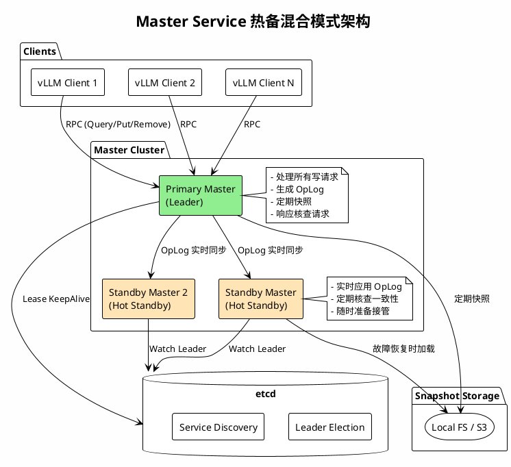
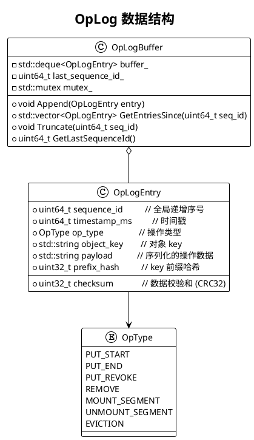
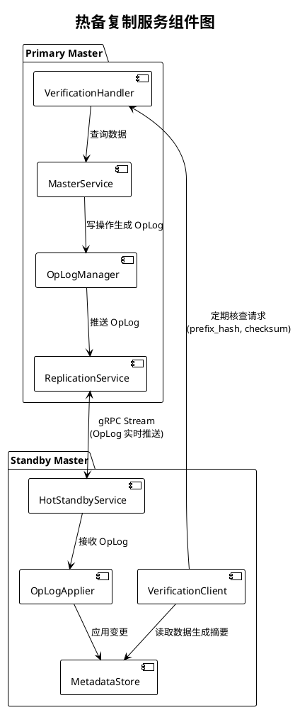
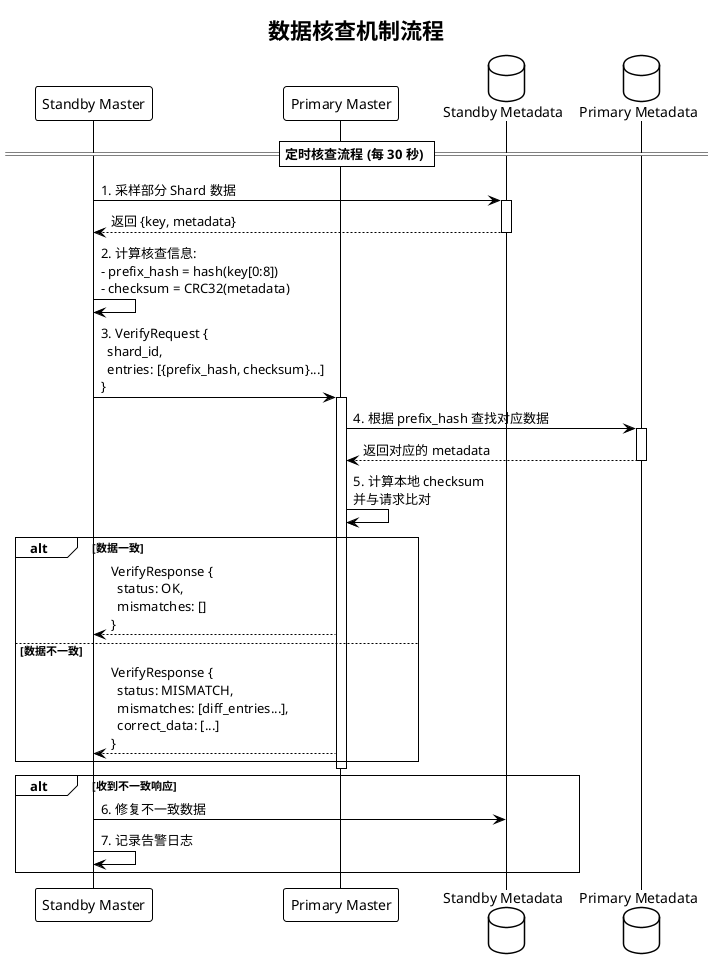
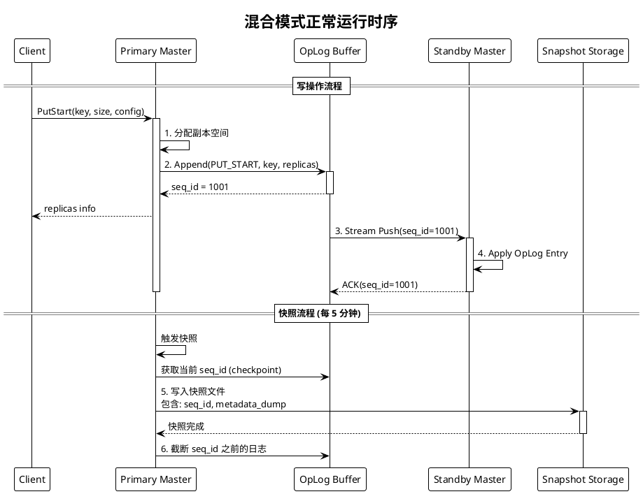
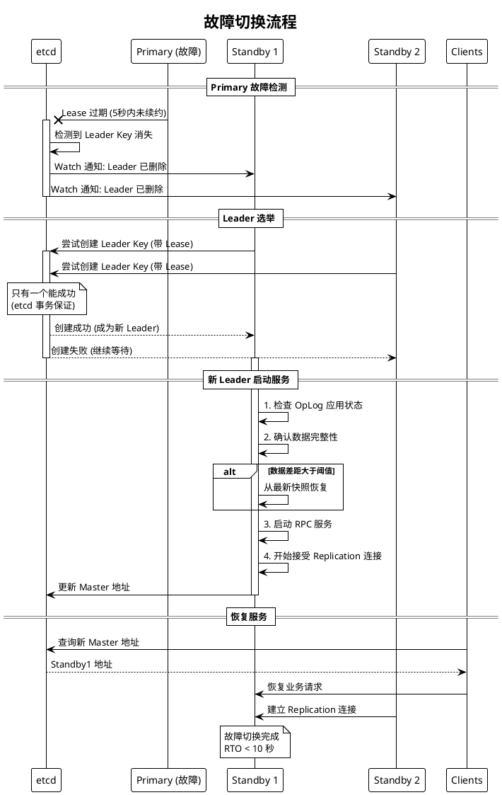
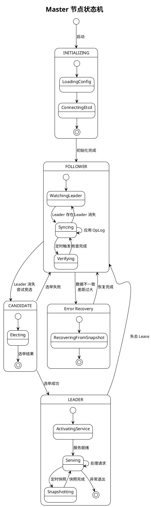
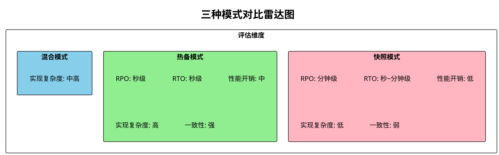
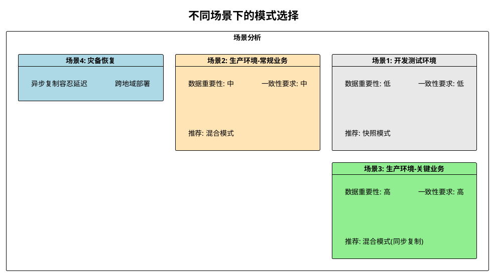

# RFC: Master Service 元数据高可用 - 热备与混合模式设计

## 文档信息

| 项目 | 内容 |
|------|------|
| 作者 | Mooncake Team |
| 状态 | Draft |
| 创建日期 | 2024-12 |
| 版本 | v1.0 |

---

## 1. 背景介绍

### 1.1 Mooncake 存储架构概述

Mooncake Store 采用元数据与数据分离的架构设计：

- **Master Service**：中心化的元数据服务，负责管理对象的副本位置、空间分配、租约管理等
- **Client 节点**：分布式的存储节点，实际存储 KV Cache 数据，通过 Transfer Engine 进行数据传输
- **etcd**：用于 Leader 选举和服务发现

```
┌─────────────────────────────────────────────────────────────────────────┐
│                     Mooncake Store 架构概览                              │
├─────────────────────────────────────────────────────────────────────────┤
│                                                                         │
│     ┌──────────────┐                                                    │
│     │    vLLM      │                                                    │
│     │  Inference   │                                                    │
│     └──────┬───────┘                                                    │
│            │                                                            │
│   ┌────────▼────────┐    Query Metadata    ┌───────────────────┐       │
│   │  Mooncake Client ├────────────────────►│  Master Service    │       │
│   │                 │◄────────────────────┤  (单点/HA模式)      │       │
│   └────────┬────────┘    Replica Info      └─────────┬─────────┘       │
│            │                                         │                  │
│            │ Data Transfer (RDMA/TCP)               │ Leader Election  │
│            ▼                                         ▼                  │
│   ┌─────────────────────────────┐           ┌──────────────────┐       │
│   │      Storage Clients        │           │       etcd        │       │
│   │  [Node1] [Node2] [Node3]    │           │   (服务发现)       │       │
│   └─────────────────────────────┘           └──────────────────┘       │
│                                                                         │
└─────────────────────────────────────────────────────────────────────────┘
```

### 1.2 当前 HA 实现

当前 Mooncake 已实现基于 etcd 的 Leader 选举机制：

- 多个 Master 实例启动后竞争成为 Leader
- 只有 Leader 对外提供 RPC 服务
- Follower 节点处于等待状态（`WatchUntilDeleted`）
- Leader 挂掉后，Follower 重新竞选

### 1.3 元数据结构

Master Service 管理的核心元数据结构（`ObjectMetadata`）：

```cpp
struct ObjectMetadata {
    std::vector<Replica> replicas;           // 副本列表（包含存储位置）
    size_t size = 0;                         // 对象大小
    std::chrono::steady_clock::time_point 
        lease_timeout;                       // 租约超时时间
    std::chrono::steady_clock::time_point 
        soft_pin_timeout;                    // 软钉住超时时间
};
```

元数据按 key 分片存储在 1024 个 shard 中：

```cpp
static constexpr size_t kNumShards = 1024;
std::array<MetadataShard, kNumShards> metadata_shards_;
```

---

## 2. 当前痛点分析

### 2.1 元数据丢失风险

| 问题 | 影响 | 严重程度 |
|------|------|----------|
| **Leader 故障后元数据全丢** | 所有 KV Cache 位置信息丢失，需要重建 | 🔴 严重 |
| **Follower 无数据预热** | 选举成功后需要从零开始服务 | 🟠 中等 |
| **恢复时间长** | 依赖客户端重新注册，可能需要几分钟到几十分钟 | 🟠 中等 |
| **服务不可用窗口** | Leader 切换期间无法处理请求 | 🟡 一般 |

### 2.2 快照模式的局限性

假设快照模式已实现，其存在以下问题：

```
                    快照模式时间线
    ─────────────────────────────────────────────────►
    │         │         │         │         │
    T1        T2        T3        T4        T5
    ▼         ▼         ▼         ▼         ▼
  [快照1]   [写入]    [写入]    [故障]    [恢复]
    │                    │         │         │
    └────────────────────┘         │         │
         这部分数据丢失  ◄──────────┘         │
                                             │
                        从快照1恢复，丢失T2-T4数据
```

| 问题 | 说明 |
|------|------|
| **RPO 不为零** | 两次快照间的数据可能丢失 |
| **快照周期两难** | 周期短→性能开销大；周期长→数据丢失多 |
| **恢复时需加载** | 大元数据集加载耗时 |
| **无法应对突发故障** | 快照正在进行时故障最糟糕 |

### 2.3 需求分析

基于以上痛点，我们需要：

1. **近零 RPO**：最小化数据丢失窗口
2. **快速故障切换**：秒级 RTO（恢复时间目标）
3. **数据一致性保证**：主备数据同步正确
4. **可验证性**：有机制验证数据完整性
5. **低性能开销**：不影响正常业务

---

## 3. 方案设计

### 3.1 整体架构

我们提出 **热备模式（Hot Standby）** 结合 **定期快照** 的 **混合模式**：



### 3.2 核心组件设计

#### 3.2.1 OpLog（操作日志）设计

OpLog 是实现热备的核心，记录所有状态变更操作：



**OpLog Entry 字段说明**：

| 字段 | 类型 | 说明 |
|------|------|------|
| `sequence_id` | uint64_t | 全局递增的序列号，保证顺序性 |
| `timestamp_ms` | uint64_t | 操作时间戳 |
| `op_type` | enum | 操作类型（PUT_START/PUT_END/REMOVE等） |
| `object_key` | string | 被操作的对象 key |
| `payload` | bytes | 操作相关的序列化数据 |
| `checksum` | uint32_t | payload 的 CRC32 校验和 |
| `prefix_hash` | uint32_t | object_key 前缀的哈希值（用于核查） |

#### 3.2.2 热备复制服务



#### 3.2.3 核查机制设计

核查机制是保证主备数据一致性的关键：



**核查请求数据结构**：

```cpp
struct VerificationEntry {
    uint32_t prefix_hash;    // key 前缀哈希 (前8字节的hash)
    uint32_t checksum;       // 该条 metadata 的 CRC32 校验和
};

struct VerificationRequest {
    uint32_t shard_id;                      // 被核查的 shard ID
    uint64_t standby_last_seq_id;           // Standby 已应用的最大 seq_id
    std::vector<VerificationEntry> entries; // 核查条目列表
};

struct VerificationResponse {
    enum Status { OK, MISMATCH, NEED_FULL_SYNC };
    Status status;
    std::vector<MismatchEntry> mismatches;  // 不一致的条目
    std::vector<CorrectData> corrections;   // 正确的数据（用于修复）
};
```

**核查策略**：

| 参数 | 默认值 | 说明 |
|------|--------|------|
| 核查间隔 | 30 秒 | 每轮核查的时间间隔 |
| 采样率 | 10% | 每轮核查的 shard 比例 |
| 单 shard 采样数 | 100 | 每个 shard 最多采样的 key 数量 |
| 全量核查周期 | 5 分钟 | 所有 shard 完成一轮核查 |

### 3.3 混合模式工作流程

#### 3.3.1 正常运行时序



#### 3.3.2 故障切换流程



### 3.4 数据结构与接口设计

#### 3.4.1 核心数据结构

```cpp
// OpLog 条目
struct OpLogEntry {
    uint64_t sequence_id;
    uint64_t timestamp_ms;
    OpType op_type;
    std::string object_key;
    std::string payload;        // 序列化的操作数据
    uint32_t checksum;          // CRC32(payload)
    uint32_t prefix_hash;       // hash(object_key.substr(0, 8))
    
    // 序列化支持
    YLT_REFL(OpLogEntry, sequence_id, timestamp_ms, op_type, 
             object_key, payload, checksum, prefix_hash);
};

// OpLog 管理器
class OpLogManager {
public:
    // 追加日志条目
    uint64_t Append(OpType type, const std::string& key, 
                    const std::string& payload);
    
    // 获取指定序号之后的所有条目
    std::vector<OpLogEntry> GetEntriesSince(uint64_t seq_id);
    
    // 获取最新序号
    uint64_t GetLastSequenceId() const;
    
    // 截断旧日志（快照后调用）
    void TruncateBefore(uint64_t seq_id);

private:
    std::deque<OpLogEntry> buffer_;
    uint64_t last_sequence_id_ = 0;
    mutable std::shared_mutex mutex_;
    
    // 限制内存使用
    static constexpr size_t kMaxBufferSize = 100000;
};

// 热备服务（运行在 Standby 节点）
class HotStandbyService {
public:
    // 连接到 Primary 并开始同步
    ErrorCode ConnectToPrimary(const std::string& primary_addr);
    
    // 处理接收到的 OpLog
    void OnOpLogReceived(const std::vector<OpLogEntry>& entries);
    
    // 获取当前同步进度
    uint64_t GetAppliedSequenceId() const;
    
    // 触发数据核查
    ErrorCode TriggerVerification();

private:
    std::unique_ptr<MetadataStore> metadata_store_;
    std::unique_ptr<OpLogApplier> applier_;
    std::unique_ptr<VerificationClient> verify_client_;
    std::atomic<uint64_t> applied_seq_id_ = 0;
};

// 复制服务（运行在 Primary 节点）
class ReplicationService {
public:
    // 注册 Standby 连接
    void RegisterStandby(const std::string& standby_id, 
                        ReplicationStream* stream);
    
    // 广播 OpLog 到所有 Standby
    void BroadcastOpLog(const OpLogEntry& entry);
    
    // 处理核查请求
    VerificationResponse HandleVerification(
        const VerificationRequest& request);

private:
    std::unordered_map<std::string, ReplicationStream*> standbys_;
    std::shared_mutex mutex_;
};
```

#### 3.4.2 RPC 接口定义

```protobuf
// 复制服务 RPC 接口
service ReplicationService {
    // OpLog 流式同步
    rpc SyncOpLog(SyncOpLogRequest) returns (stream OpLogEntry);
    
    // 数据核查
    rpc Verify(VerificationRequest) returns (VerificationResponse);
    
    // 请求全量快照
    rpc RequestSnapshot(SnapshotRequest) returns (SnapshotResponse);
}

message SyncOpLogRequest {
    uint64 start_seq_id = 1;    // 从哪个序号开始同步
    string standby_id = 2;       // Standby 标识
}

message VerificationRequest {
    uint32 shard_id = 1;
    uint64 standby_last_seq_id = 2;
    repeated VerificationEntry entries = 3;
}

message VerificationEntry {
    uint32 prefix_hash = 1;     // key 前缀哈希
    uint32 checksum = 2;        // metadata 校验和
}

message VerificationResponse {
    enum Status {
        OK = 0;
        MISMATCH = 1;
        NEED_FULL_SYNC = 2;
    }
    Status status = 1;
    repeated MismatchEntry mismatches = 2;
}

message MismatchEntry {
    uint32 prefix_hash = 1;
    string object_key = 2;
    bytes correct_metadata = 3;  // 正确的元数据
}
```

### 3.5 状态机设计



### 3.6 配置参数

```cpp
struct HotStandbyConfig {
    // OpLog 配置
    size_t oplog_buffer_size = 100000;       // OpLog 缓冲区大小
    uint64_t oplog_retention_ms = 300000;    // OpLog 保留时间 (5分钟)
    
    // 复制配置
    uint32_t replication_batch_size = 100;   // 批量同步条数
    uint32_t replication_timeout_ms = 1000;  // 同步超时时间
    bool sync_replication = false;           // 是否同步复制
    
    // 核查配置
    uint32_t verify_interval_sec = 30;       // 核查间隔
    float verify_sample_ratio = 0.1;         // 采样率 (10%)
    uint32_t verify_entries_per_shard = 100; // 每 shard 采样数
    
    // 快照配置
    uint32_t snapshot_interval_sec = 300;    // 快照间隔 (5分钟)
    std::string snapshot_path = "/var/mooncake/snapshots";
    
    // 故障切换配置
    uint64_t max_lag_for_promotion_ms = 5000; // 允许晋升的最大延迟
};
```

---

## 4. 方案对比分析

### 4.1 三种模式对比



### 4.2 详细对比表

| 维度 | 快照模式 | 热备模式 | 混合模式 |
|------|----------|----------|----------|
| **RPO（数据丢失）** | 分钟级（快照间隔） | 秒级（异步）/ 0（同步） | 秒级 |
| **RTO（恢复时间）** | 10秒~分钟（取决于数据量） | < 5秒（热切换） | < 5秒 |
| **性能开销** | 低（只在快照时） | 中（持续同步） | 中 |
| **存储开销** | 高（完整快照） | 低（只有 OpLog） | 中（快照+OpLog） |
| **实现复杂度** | 低 | 高 | 中高 |
| **网络带宽** | 低（周期性） | 中（持续） | 中 |
| **一致性保证** | 最终一致 | 强一致（可配置） | 强一致 |
| **可验证性** | 弱 | 强（核查机制） | 强 |
| **冷启动恢复** | ✅ 支持 | ❌ 依赖主节点 | ✅ 支持 |
| **适用场景** | 低频更新、大数据量 | 高频更新、强一致需求 | 通用场景 |

### 4.3 各模式优缺点分析

#### 快照模式

**优点**：
- ✅ 实现简单，成熟可靠
- ✅ 性能开销可预测
- ✅ 支持独立冷启动恢复
- ✅ 对主节点影响小

**缺点**：
- ❌ RPO 较大，可能丢失大量数据
- ❌ 大数据量时恢复慢
- ❌ 无法验证数据一致性
- ❌ 快照期间性能抖动

#### 热备模式

**优点**：
- ✅ RPO 极低，近乎零丢失
- ✅ RTO 极低，秒级切换
- ✅ 支持核查机制，可验证一致性
- ✅ Standby 随时可接管

**缺点**：
- ❌ 实现复杂度高
- ❌ 需要持续网络带宽
- ❌ 单独使用时无法冷启动
- ❌ OpLog 管理复杂

#### 混合模式（推荐）

**优点**：
- ✅ 兼具热备的低 RPO/RTO
- ✅ 支持冷启动恢复（从快照）
- ✅ 核查机制保证一致性
- ✅ 容错能力强

**缺点**：
- ❌ 实现复杂度较高
- ❌ 运维复杂度增加
- ❌ 需要额外存储空间

### 4.4 场景适用性分析



---

## 5. 实现计划

### 5.1 阶段划分

```plantuml
@startuml
!theme plain
title 实现阶段甘特图

project starts 2024-12-15

[阶段1: OpLog 基础设施] starts 2024-12-15 and lasts 14 days
[OpLog 数据结构实现] starts 2024-12-15 and lasts 7 days
[OpLog 序列化/反序列化] starts 2024-12-22 and lasts 7 days

[阶段2: 复制服务] starts 2024-12-29 and lasts 21 days
[复制 RPC 接口] starts 2024-12-29 and lasts 7 days
[HotStandbyService 实现] starts 2025-01-05 and lasts 14 days

[阶段3: 核查机制] starts 2025-01-19 and lasts 14 days
[核查协议实现] starts 2025-01-19 and lasts 7 days
[修复逻辑实现] starts 2025-01-26 and lasts 7 days

[阶段4: 混合模式集成] starts 2025-02-02 and lasts 14 days
[与快照模式集成] starts 2025-02-02 and lasts 7 days
[状态机完善] starts 2025-02-09 and lasts 7 days

[阶段5: 测试与调优] starts 2025-02-16 and lasts 14 days

@enduml
```

### 5.2 文件结构

```
mooncake-store/
├── include/
│   ├── oplog.h                 # OpLog 数据结构
│   ├── oplog_manager.h         # OpLog 管理器
│   ├── hot_standby_service.h   # 热备服务
│   ├── replication_service.h   # 复制服务
│   ├── verification.h          # 核查相关
│   └── hybrid_ha_config.h      # 混合模式配置
├── src/
│   ├── oplog.cpp
│   ├── oplog_manager.cpp
│   ├── hot_standby_service.cpp
│   ├── replication_service.cpp
│   └── verification.cpp
└── tests/
    ├── oplog_test.cpp
    ├── replication_test.cpp
    ├── verification_test.cpp
    └── e2e/
        └── hybrid_ha_test.cpp
```

---

## 6. 风险与缓解措施

| 风险 | 概率 | 影响 | 缓解措施 |
|------|------|------|----------|
| OpLog 积压导致内存溢出 | 中 | 高 | 设置缓冲区上限，超限触发快照并截断 |
| 网络分区导致脑裂 | 低 | 高 | etcd Lease 机制 + fencing token |
| 主备数据不一致 | 中 | 中 | 核查机制定期检测并修复 |
| 性能下降 | 中 | 中 | 异步复制 + 批量处理 |
| 快照过大导致恢复慢 | 低 | 中 | 增量快照 + 并行加载 |

---

## 7. 总结

本方案提出了 **热备+快照混合模式** 来解决 Master Service 元数据可靠性问题：

1. **热备模式** 提供秒级 RPO/RTO，通过 OpLog 实时同步确保数据近乎零丢失
2. **核查机制** 定期验证主备数据一致性，使用 prefix_hash + checksum 高效检测差异
3. **快照模式** 作为兜底，支持冷启动恢复和长期数据保护
4. **混合模式** 结合两者优点，适用于大多数生产场景

该方案在保证数据可靠性的同时，尽量降低对正常业务的性能影响，是 Mooncake 走向生产就绪的重要一步。


